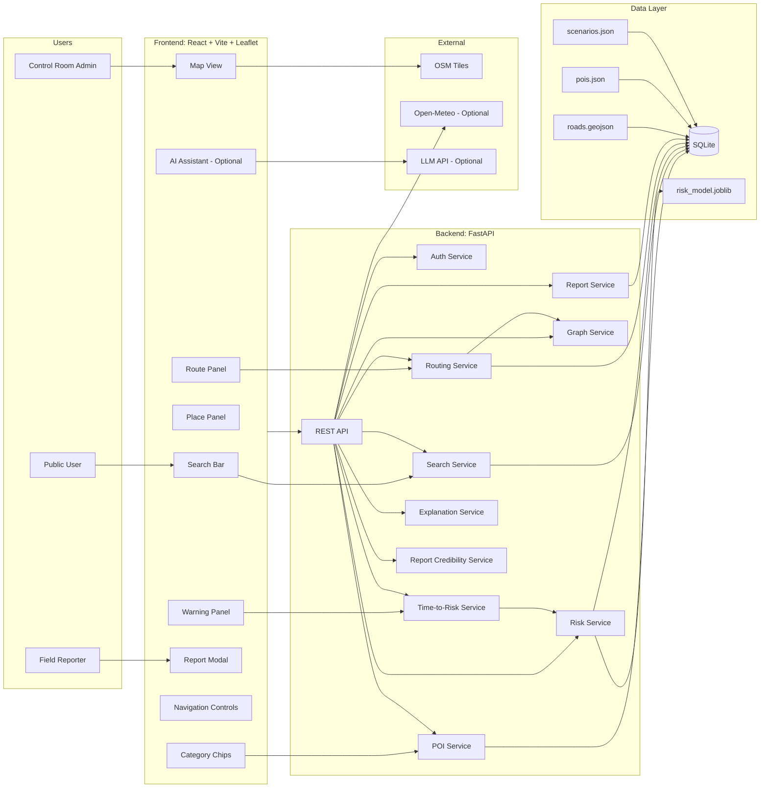
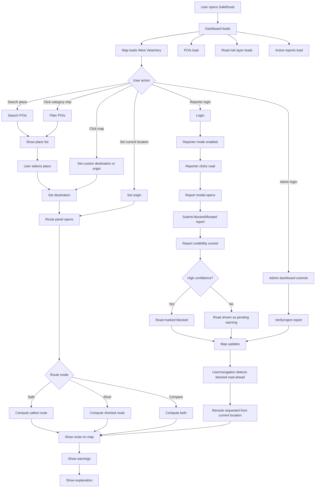
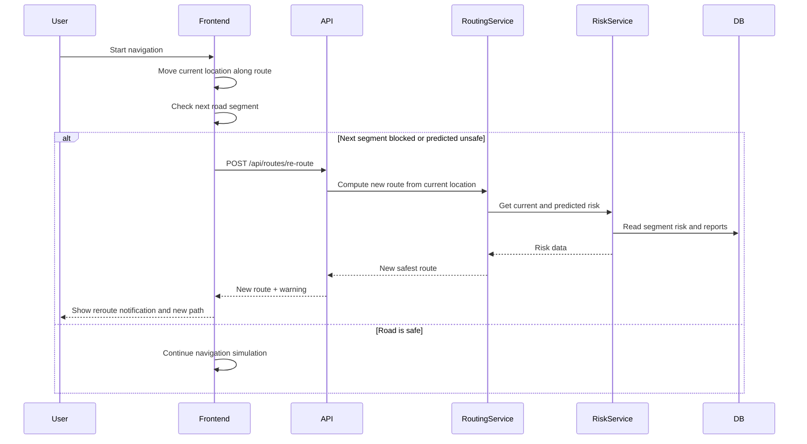

# benchmark_layer.md

Project: **SafeRoute Velachery — Flood-Aware Navigation & Emergency Routing**  
Layer: **Benchmark Layer / Core Working Product**  
Goal: Build a clean, Google Maps-like flood navigation dashboard for West Velachery with safe routing, blocked-road awareness, important place discovery, and visible AI value.

---

## 1. Revised Product Direction

The product should not be only “navigate to shelters.”

It should behave like a **flood-aware Google Maps for West Velachery**:

> User selects any important destination such as a shelter, hospital, petrol bunk, police station, pharmacy, school, or clicks anywhere on the map.  
> The system shows the shortest route and the safest route based on current flooding, predicted flood risk, blocked roads, and topography/weather-based AI prediction.

The benchmark layer must prove:

1. Clean map dashboard.
2. Important places highlighted like Google Maps.
3. Custom destination selection.
4. Safe route vs short route.
5. Flooded / likely-flooded / blocked road visualization.
6. Reporter-based blocked road marking.
7. Rerouting when a road becomes blocked.
8. AI-based risk prediction with clear uncertainty.
9. Strong foundation for adding AI chatbot and advanced prediction later.

---

## 2. Direct Answers to Your 8 Points

---

## 2.1 “Currently my solution doesn’t have much AI. How do we make AI central?”

Your solution can have meaningful AI in multiple places. Do not add AI only as a chatbot.

Use AI in these five layers:

| AI Layer | What AI Does | Why It Matters |
|---|---|---|
| AI Road Risk Prediction | Predicts which road segments are likely flooded or unsafe. | Directly affects routing. |
| AI Time-to-Risk Prediction | Predicts whether a road may become unsafe before the traveler reaches it. | Gives warnings like “This road may flood in 18 minutes, you will reach in 30 minutes.” |
| AI Route Optimization | Chooses safest route using current risk, predicted risk, blocked reports, road type, and shelter/POI suitability. | This is the core decision-making AI. |
| AI Report Credibility Scoring | Scores blocked-road reports based on source, duplicates, weather match, and flood history. | Prevents fake/random reports from breaking routing. |
| AI Assistant / Chatbot | Answers questions using live system data, not generic LLM text. | Improves usability and demo appeal. |

For the benchmark layer, implement the first three AI layers. Add chatbot after the base product works.

---

## 2.2 “Users should select any location, not only shelters. Important places should be highlighted.”

Yes. This is a strong improvement.

The benchmark layer will support:

### Destination Types

1. **Important places / POIs**
   - Shelters
   - Hospitals
   - Clinics
   - Petrol bunks
   - Police stations
   - Fire stations
   - Pharmacies
   - Schools
   - Community centers

2. **Custom map location**
   - User clicks anywhere on the map.
   - Backend snaps that point to the nearest road node.
   - Route is generated to that snapped location.

### Important Place Highlighting

Display POIs with category icons and colors:

| Category | Color | Icon Idea |
|---|---|---|
| Shelter | Green | house / shelter |
| Hospital | Red | cross |
| Clinic | Pink | medical icon |
| Police Station | Blue | shield |
| Petrol bunk | Amber | fuel pump |
| Fire Station | Orange | flame |
| Pharmacy | Teal | medicine |
| School | Purple | school building |

This makes the map feel more like Google Maps.

---

## 2.3 “The app should work exactly like Google Maps but with flood features.”

For a 30-hour hackathon, do not build all of Google Maps.

Build a **Google Maps-like experience for one small area**.

### Benchmark Google Maps-like Features

| Feature | Benchmark Implementation |
|---|---|
| Map pan/zoom | Leaflet map |
| Search destination | Search only curated POIs and roads/places inside Velachery dataset |
| Click destination on map | Supported |
| Route display | Shortest route and safest route |
| Place markers | POI markers with icons |
| Directions summary | Simple step list, not voice navigation |
| Blocked roads | Shown as dark red dashed lines |
| Flooded roads | Shown by risk color |
| Reroute | Triggered when blocked road is ahead |

### Not Required for Benchmark

Do not build:

- Full global geocoding
- Live traffic
- Voice navigation
- Real-time GPS tracking from mobile
- Turn-by-turn voice guidance
- Multi-city support
- Offline native mobile app

This keeps the project feasible.

---

## 2.4 “Who is the reporter? Who is the admin?”

This is an important product design question.

### Reporter

The reporter is not a random anonymous user in the benchmark.

Reporter can be:

1. Municipal field worker
2. Police / home guard personnel
3. Disaster response volunteer
4. RWA / community coordinator
5. Control room operator
6. Verified citizen in future version

For the hackathon demo:

> Reporter = **Field Reporter / Verified Volunteer / Control Room Field Unit**

The reporter knows a road is blocked because of:

- Direct field observation
- Public call to control room
- Police / traffic update
- Waterlogging seen on site
- CCTV observation, if integrated later
- AI prediction, if marked as AI-suggested report

### Admin

Admin is the system/control room operator.

In real deployment, admin could be:

- Greater Chennai Corporation disaster control room
- District disaster management authority
- Traffic police control room
- Emergency operations center

For hackathon demo:

> Admin = **SafeRoute Control Room Operator**

Admin can:

- Verify or reject reports
- Manage POIs
- Activate flood scenarios
- Override blocked roads
- View validation and system health

### Important Rule

Anonymous public users should not directly mark a road as blocked.

They can only:

- View map
- Search places
- Request routes
- Optionally submit low-confidence citizen reports in future

In benchmark:

- Public user: view and navigate
- Reporter: create field reports
- Admin: verify/reject/manage

---

## 2.5 “If a route is blocked exactly when the person reaches that place, how do we renavigate?”

Implement a **navigation/reroute simulation**.

In a real app, the user’s GPS location updates continuously.

For the hackathon demo, use simulated navigation:

1. User selects destination.
2. Route is shown.
3. User clicks “Start Navigation” or “Simulate Movement.”
4. Current location marker moves along the route.
5. System checks the road immediately ahead.
6. If the next road is blocked or predicted to become unsafe, the app shows:

```text
Road ahead is blocked. Rerouting...
```

7. System calls route API again using the current simulated location as the new origin.
8. New safe route is drawn.
9. Old route becomes gray/faded.

### Reroute Logic

```text
Every few seconds:
  get current simulated location
  find current route segment
  if current segment or next segment is blocked:
      request new route from current location to destination
      show reroute notification
  else if next segment is predicted to become high-risk before arrival:
      show warning
      optionally reroute automatically
```

This is enough for a strong demo.

---

## 2.6 “Can AI predict blocked/flooded roads? How do we know exactly that a road is blocked?”

Important distinction:

> AI can predict risk.  
> AI cannot always know with 100% certainty that a road is blocked.

So the UI must separate:

| Status | Meaning | Source |
|---|---|---|
| Confirmed blocked | Someone verified it is blocked | Reporter/admin/police/control room |
| Currently flooded | Observed flooding | Reporter/admin/sensor/CCTV |
| Likely flooded soon | AI prediction | Weather + topography + history |
| Possible risk | Moderate AI risk | Weather + drainage + history |
| Low risk | Likely safe | Low prediction score |

### How to Know a Road Is Actually Blocked?

For MVP, use:

1. Field reporter confirmation
2. Admin verification
3. Police/control room input
4. Duplicate reports from same area
5. Historical flood-prone segment data
6. Weather severity matching

Future production sources:

1. Water level sensors
2. CCTV computer vision
3. Satellite flood imagery
4. Vehicle telematics
5. Official open data feeds
6. Crowd reports with verification

### Time-Based Risk Warning

You asked:

> If a route takes 30 minutes and a road is likely to be blocked in 18 minutes, the user should be warned.

Yes. Implement this as:

```text
For each segment on the route:
  calculate ETA to reach that segment
  calculate predicted time until that segment becomes high-risk

  if ETA_to_segment > predicted_time_to_high_risk:
      show warning
```

Example warning:

```text
AGS Colony Road may become high-risk in approximately 18 minutes.
You are expected to reach it in 30 minutes.
Consider taking the safer alternate route.
```

This is a very strong AI feature for judges.

---

## 2.7 “Should we integrate an AI chatbot?”

Yes, but only after the benchmark layer is stable.

The chatbot should not be a generic FAQ bot.

It should be an **AI Situational Assistant** connected to your system data.

It should answer:

- “Is AGS Colony Road flooded?”
- “What is the safest route to the nearest hospital?”
- Which shelters are open?”
- “Will rain increase in the next hour?”
- “Which roads are likely to flood in 30 minutes?”
- “Is the route to Velachery police station safe?”

### Recommended Chatbot Architecture

Use LLM with tool/function calling.

Tools:

```text
get_weather_scenario()
get_road_status(road_name)
get_route(origin, destination)
get_blocked_reports()
get_open_shelters()
get_pois(category)
get_risk_warnings()
```

For benchmark layer:

- Build the core map and routing first.
- Add a disabled “AI Assistant” button.
- If time remains, enable chatbot using the same APIs.

Do not make the core product depend on the chatbot.

---

## 2.8 “First build a basic layer. Create benchmark_layer.md.”

This document is the benchmark layer plan.

It defines the basic working product before advanced AI/chatbot features.

---

# 3. Benchmark Layer Scope

## 3.1 Must Have in Benchmark Layer

| Feature | Required |
|---|---|
| Clean dashboard UI | Yes |
| Velachery map | Yes |
| Road network layer | Yes |
| POI layer: shelters, hospitals, petrol bunks, police stations | Yes |
| Search/filter important places | Yes |
| Click custom destination | Yes |
| Origin selection | Yes |
| Shortest route | Yes |
| Safest route | Yes |
| Road flood risk colors | Yes |
| Blocked road display | Yes |
| Reporter login | Yes |
| Mark road blocked | Yes |
| Admin verification | Basic |
| Reroute after blocked road | Yes |
| AI risk score per road | Yes |
| Predicted time-to-risk warning | Basic |
| Explanation panel | Yes |

## 3.2 Optional After Benchmark

| Feature | Priority |
|---|---|
| AI chatbot | High, after benchmark |
| Citizen reports | Medium |
| CCTV vision detection | Low for hackathon |
| Satellite flood detection | Low for hackathon |
| Voice navigation | Low |
| Multi-language | Low |
| Real GPS tracking | Low for demo |
| Live weather integration | Medium |

---

# 4. Benchmark Architecture Diagram



---

# 5. Full Website Flow Diagram



---

# 6. Reroute Flow Diagram



---

# 7. Benchmark Dashboard UI Diagram

This is the recommended clean UI layout.

```text
+==============================================================================================+
| SafeRoute Velachery                                                                          |
| [Search: hospital, shelter, police, petrol...]   [Scenario: Michaung Replay]  [Login]       |
| [Shelters] [Hospitals] [Police] [Petrol Bunks] [Pharmacies] [Reports] [AI Assistant]        |
+===================+==========================================================================+
|                   |                                                                          |
| LEFT PANEL        |                            MAP AREA                                      |
|                   |                                                                          |
| [Results]         |        POI markers:                                                      |
| - Hospital list   |        Hospital = red cross                                              |
| - Shelter list    |        Shelter = green house                                              |
| - Police list     |        Police = blue shield                                               |
|                   |        Petrol = amber fuel icon                                           |
| [Route Card]      |                                                                          |
| From: Set origin  |        Roads colored by risk                                             |
| To: Selected POI  |        Green/Yellow/Orange/Red/Dark red dashed                           |
|                   |                                                                          |
| [Safe Route]      |              Origin marker                                               |
| [Short Route]     |                   |                                                      |
| [Compare]         |                   | Safe route                                           |
|                   |                   |                                                      |
| [Warnings]        |        Destination POI marker                                            |
| - Road may flood  |                                                                          |
| - Blocked ahead   |                                                                          |
|                   |                                                                          |
| [Explanation]     |                                                                          |
| - Avoids risk     |                                                                          |
| - Adds 3 min      |                                                                          |
|                   |                                                                          |
+===================+==========================================================================+
| Navigation / Status Bar                                                                      |
| [Start Simulation] [Pause] [Reroute]   Active scenario | Last updated | Server status       |
+==============================================================================================+
```

---

## 7.1 What Is Shown Where?

| UI Area | What Is Projected |
|---|---|
| Top search bar | Search POIs by name/category |
| Category chips | Quick filter: shelters, hospitals, police, petrol |
| Left panel results | List of matching important places |
| Route card | From, To, Safe/Short buttons |
| Map | Roads, POIs, origin, destination, routes, blocked roads |
| Warnings panel | Predicted flood warnings and blocked-road alerts |
| Explanation panel | Why safe route was chosen |
| Status bar | Scenario, last updated, simulation controls |

---

# 8. Benchmark Data Model

Use SQLite for MVP.

## 8.1 users

```text
id
username
password_hash
role = public | reporter | admin
is_active
created_at
```

## 8.2 nodes

```text
id
lat
lon
lon_lat_key
```

## 8.3 road_segments

```text
id
osm_way_id
name
road_type
from_node_id
to_node_id
length_m
geometry_json
is_underpass
low_lying_prior
drainage_proxy
hazard_category
historical_flood_count
ml_static_propensity
current_risk_score
current_risk_level
predicted_time_to_high_risk_min
blocked
flood_status = unknown | safe | possible_risk | likely_flooded | confirmed_flooded
updated_at
```

## 8.4 pois

```text
id
external_id
name
category = shelter | hospital | clinic | police_station | petrol_bunk | fire_station | pharmacy | school | community_center
lat
lon
address
phone
status = open | closed | unknown
nearest_node_id
source
notes
created_at
```

## 8.5 shelter_details

Optional table for shelters only.

```text
poi_id
capacity_assumed
occupancy_assumed
elevation_risk
accessible
medical_support
water_available
```

## 8.6 scenarios

```text
id
name
description
rainfall_mm_24h
rainfall_mm_1h
source
is_active
created_at
```

## 8.7 blocked_reports

```text
id
segment_id
user_id
source = control_room | field_official | trusted_volunteer | citizen | ai_prediction
note
status = active | resolved | rejected
verification_status = pending | confirmed | rejected
credibility_score
created_at
resolved_at
```

## 8.8 route_requests

```text
id
scenario_id
origin_lat
origin_lon
origin_node_id
destination_type = poi | custom
destination_poi_id
destination_lat
destination_lon
destination_node_id
route_mode = safe | short | balanced
status
error_code
created_at
```

## 8.9 route_results

```text
id
request_id
route_type = safe | short
poi_id
node_sequence_json
edge_sequence_json
geometry_json
distance_m
duration_min
cost_score
avg_risk_score
high_risk_segments_count
blocked_segments_encountered
predicted_risk_warnings_count
created_at
```

## 8.10 route_warnings

```text
id
route_result_id
segment_id
warning_type = predicted_flood_before_arrival | blocked_ahead | high_risk_area
eta_to_segment_min
predicted_time_to_high_risk_min
message
created_at
```

---

# 9. Benchmark API Specification

Base URL:

```text
/api
```

---

## 9.1 GET /api/health

Purpose:

Check backend and data status.

Response:

```json
{
  "status": "ok",
  "model_loaded": true,
  "active_scenario_id": 3,
  "road_count": 420,
  "poi_count": 28
}
```

---

## 9.2 POST /api/auth/login

Purpose:

Login reporter/admin.

Request:

```json
{
  "username": "reporter",
  "password": "password"
}
```

Response:

```json
{
  "access_token": "jwt",
  "token_type": "Bearer",
  "user": {
    "id": 2,
    "username": "reporter",
    "role": "reporter"
  }
}
```

---

## 9.3 GET /api/meta/area

Purpose:

Get map bounds and default center.

Response:

```json
{
  "name": "West Velachery, Chennai",
  "bbox": [12.965, 80.195, 12.995, 80.235],
  "default_center": [12.981, 80.213],
  "default_zoom": 15
}
```

---

## 9.4 GET /api/pois

Purpose:

List important places.

Query params:

```text
category = shelter | hospital | police_station | petrol_bunk | pharmacy | school | fire_station | clinic
q = search text
status = open | closed | unknown
```

Example:

```text
GET /api/pois?category=hospital&q=velachery
```

Response:

```json
[
  {
    "id": 5,
    "name": "Hospital Name",
    "category": "hospital",
    "lat": 12.980,
    "lon": 80.218,
    "address": "Velachery Main Road",
    "status": "open",
    "distance_m": null
  }
]
```

---

## 9.5 GET /api/pois/{id}

Purpose:

Get one POI.

Response:

```json
{
  "id": 5,
  "name": "Hospital Name",
  "category": "hospital",
  "lat": 12.980,
  "lon": 80.218,
  "status": "open",
  "nearest_node_id": 244
}
```

---

## 9.6 GET /api/scenarios

Purpose:

Get rainfall scenarios.

Response:

```json
[
  {
    "id": 1,
    "name": "Normal",
    "rainfall_mm_24h": 10,
    "rainfall_mm_1h": 0,
    "is_active": false
  },
  {
    "id": 3,
    "name": "Michaung Replay",
    "rainfall_mm_24h": 150,
    "rainfall_mm_1h": 30,
    "is_active": true
  }
]
```

---

## 9.7 GET /api/map/geojson

Purpose:

Get map layers.

Query params:

```text
scenario_id
include = roads,pois,reports
```

Response:

```json
{
  "type": "FeatureCollection",
  "features": [
    {
      "type": "Feature",
      "geometry": {
        "type": "LineString",
        "coordinates": [[80.210, 12.978], [80.211, 12.979]]
      },
      "properties": {
        "layer_type": "road",
        "segment_id": 12,
        "name": "AGS Colony Road",
        "current_risk_score": 0.82,
        "current_risk_level": "critical",
        "predicted_time_to_high_risk_min": 0,
        "blocked": true,
        "flood_status": "confirmed_flooded"
      }
    },
    {
      "type": "Feature",
      "geometry": {
        "type": "Point",
        "coordinates": [80.218, 12.980]
      },
      "properties": {
        "layer_type": "poi",
        "poi_id": 5,
        "name": "Hospital Name",
        "category": "hospital",
        "status": "open"
      }
    }
  ]
}
```

---

## 9.8 POST /api/routes

Purpose:

Create route.

Request:

```json
{
  "origin": {
    "lat": 12.978,
    "lon": 80.210
  },
  "destination": {
    "poi_id": 5
  },
  "route_mode": "safe",
  "scenario_id": 3,
  "include_alternatives": true
}
```

Destination can also be:

```json
{
  "destination": {
    "lat": 12.982,
    "lon": 80.215
  }
}
```

Response:

```json
{
  "request_id": 10,
  "destination": {
    "type": "poi",
    "poi_id": 5,
    "name": "Hospital Name",
    "category": "hospital"
  },
  "routes": [
    {
      "route_type": "safe",
      "distance_m": 1820,
      "duration_min": 9.7,
      "avg_risk_score": 0.18,
      "high_risk_segments_count": 0,
      "blocked_segments_encountered": 0,
      "predicted_risk_warnings_count": 0,
      "geometry": {
        "type": "LineString",
        "coordinates": []
      }
    },
    {
      "route_type": "short",
      "distance_m": 1450,
      "duration_min": 7.1,
      "avg_risk_score": 0.63,
      "high_risk_segments_count": 4,
      "blocked_segments_encountered": 0,
      "predicted_risk_warnings_count": 2,
      "geometry": {
        "type": "LineString",
        "coordinates": []
      }
    }
  ],
  "warnings": [
    {
      "warning_type": "predicted_flood_before_arrival",
      "road_name": "AGS Colony Road",
      "eta_to_segment_min": 30,
      "predicted_time_to_high_risk_min": 18,
      "message": "This road may become high-risk before you reach it."
    }
  ],
  "explanation": {
    "safe_route_adds_min": 2.6,
    "high_risk_segments_avoided": 4,
    "blocked_segments_avoided": 0,
    "summary": "Safe route avoids low-lying flood-prone roads near AGS Colony."
  }
}
```

---

## 9.9 POST /api/routes/re-route

Purpose:

Reroute from current location.

Request:

```json
{
  "current_location": {
    "lat": 12.979,
    "lon": 80.211
  },
  "destination": {
    "poi_id": 5
  },
  "reason": "blocked_ahead",
  "route_mode": "safe"
}
```

Response:

Same as `/api/routes`.

---

## 9.10 POST /api/reports/blocked

Purpose:

Reporter marks road blocked/flooded.

Authentication:

Reporter or admin.

Request:

```json
{
  "segment_id": 214,
  "source": "field_official",
  "note": "Waterlogging near AGS Colony entrance",
  "flood_status": "confirmed_flooded"
}
```

Response:

```json
{
  "report_id": 8,
  "segment_id": 214,
  "verification_status": "confirmed",
  "credibility_score": 0.88,
  "road_status": {
    "blocked": true,
    "flood_status": "confirmed_flooded",
    "current_risk_level": "critical"
  }
}
```

---

## 9.11 POST /api/reports/{id}/verify

Purpose:

Admin verifies report.

Authentication:

Admin.

Request:

```json
{
  "decision": "confirm"
}
```

or:

```json
{
  "decision": "reject"
}
```

---

## 9.12 GET /api/reports/active

Purpose:

Get active blocked/flood reports.

Response:

```json
[
  {
    "id": 8,
    "segment_id": 214,
    "road_name": "AGS Colony Road",
    "source": "field_official",
    "verification_status": "confirmed",
    "note": "Waterlogging near AGS Colony entrance",
    "created_at": "2026-08-19T09:12:00Z"
  }
]
```

---

# 10. Frontend Implementation Plan

## 10.1 Frontend Stack

| Technology | Purpose |
|---|---|
| React | UI components |
| Vite | Fast dev/build |
| TypeScript | Type safety |
| Leaflet | Map rendering |
| Zustand | State management |
| Tailwind CSS | Clean UI styling |
| Fetch API | Backend calls |

---

## 10.2 Frontend Pages

| Route | Page |
|---|---|
| `/` | Dashboard |
| `/login` | Login |

---

## 10.3 Main Components

| Component | Responsibility |
|---|---|
| `AppShell` | Header, layout, status bar |
| `SearchBar` | Search POIs |
| `CategoryChips` | Filter POIs by category |
| `MapPanel` | Main Leaflet map |
| `RoadLayer` | Draw roads with risk colors |
| `POILayer` | Draw important place markers |
| `RouteLayer` | Draw safe/short routes |
| `ReportLayer` | Draw active reports |
| `PlaceResultsPanel` | Show search results |
| `RoutePanel` | From/to and route buttons |
| `WarningsPanel` | Show predicted flood warnings |
| `ExplanationPanel` | Show why safe route is better |
| `ReportModal` | Reporter submits blocked road |
| `NavigationSimulator` | Simulates movement and reroute |
| `LoginButton` | Login/logout |
| `AIAssistantButton` | Optional future chatbot entry |

---

## 10.4 Frontend State

```ts
interface AppState {
  user: User | null;
  token: string | null;

  scenarioId: number | null;
  scenarios: Scenario[];

  pois: POI[];
  selectedPoi: POI | null;

  origin: LatLng | null;
  destination: Destination | null;

  routeResponse: RouteResponse | null;
  activeReports: BlockedReport[];

  mapMode: "pan" | "set_origin" | "set_destination" | "report_road";

  navigationActive: boolean;
  currentLocation: LatLng | null;

  loading: boolean;
  error: string | null;
}
```

---

## 10.5 Map Color Rules

### Road Risk Colors

| Risk Level | Color |
|---|---|
| low | `#22c55e` |
| moderate | `#facc15` |
| high | `#f97316` |
| critical | `#dc2626` |
| confirmed blocked | `#7f1d1d` dashed |
| pending report | `#f59e0b` dashed |

### Route Colors

| Route | Color |
|---|---|
| Safe route | `#2563eb` solid |
| Short route | `#94a3b8` dashed |
| Old rerouted path | `#cbd5e1` faded |
| Navigation path | `#1d4ed8` bold |

---

## 10.6 Search Behavior

Search should work locally on POI dataset.

Logic:

```text
When user types:
  filter POIs where name contains query
  or category contains query
  or address contains query

When category chip clicked:
  filter POIs by category

When POI selected:
  set destination
  center map on POI
  open route panel
```

Do not build full geocoding in benchmark.

---

## 10.7 Route Panel Behavior

Route panel should show:

```text
From:
  [Use map click]
  [Current simulated location]

To:
  Selected POI name or custom point

Route Mode:
  Safe
  Short
  Compare

Buttons:
  Get Route
  Clear
```

After route response:

```text
Safe Route:
  Distance: 1.8 km
  Time: 9.7 min
  Risk: Low
  Warnings: 0

Short Route:
  Distance: 1.4 km
  Time: 7.1 min
  Risk: High
  Warnings: 2

Explanation:
  Safe route avoids 4 high-risk segments.
  It adds 2.6 minutes.
```

---

# 11. Backend Implementation Plan

## 11.1 Backend Stack

| Technology | Purpose |
|---|---|
| FastAPI | API server |
| SQLAlchemy | ORM |
| SQLite | Database |
| Pydantic | Validation |
| scikit-learn | AI risk model |
| NetworkX or custom Dijkstra | Routing |
| passlib | Password hashing |
| python-jose | JWT |

---

## 11.2 Backend Services

| Service | Responsibility |
|---|---|
| `auth_service` | Login, JWT, roles |
| `poi_service` | CRUD/read POIs |
| `search_service` | Filter POIs |
| `geo_service` | Haversine, snapping, geometry |
| `graph_service` | Build road graph |
| `risk_service` | Compute current flood risk |
| `time_risk_service` | Compute predicted time-to-high-risk |
| `routing_service` | Safe/short route calculation |
| `report_service` | Blocked/flood reports |
| `credibility_service` | Score report confidence |
| `explanation_service` | Generate explanation |

---

# 12. Benchmark AI Design

This is the minimum AI needed for the benchmark layer.

---

## 12.1 AI Road Risk Score

Use static flood propensity plus dynamic rainfall scenario.

Inputs:

```text
ml_static_propensity
rainfall_mm_1h
rainfall_mm_24h
underpass flag
blocked report
low_lying_prior
```

Simplified formula:

```python
combined_rain = min(
    1.0,
    (0.7 * min(1.0, rainfall_mm_24h / 150.0)) +
    (0.3 * min(1.0, rainfall_mm_1h / 30.0))
)

static_propensity = segment.ml_static_propensity or segment.drainage_proxy

blocked_factor = 1.0 if segment.blocked else 0.0
underpass_factor = 1.0 if segment.is_underpass else 0.0

risk_score = (
    0.45 * combined_rain +
    0.30 * static_propensity +
    0.10 * underpass_factor +
    0.10 * blocked_factor +
    0.05 * segment.low_lying_prior
)

risk_score = clamp(risk_score, 0.0, 1.0)
```

Risk levels:

```text
0.00 to 0.24 = low
0.25 to 0.49 = moderate
0.50 to 0.74 = high
0.75 to 1.00 = critical
```

---

## 12.2 AI Time-to-Risk Prediction

Purpose:

Estimate when a road may become high-risk.

Benchmark formula:

```python
if segment.blocked or risk_score >= 0.75:
    predicted_time_to_high_risk_min = 0
else:
    rain_factor = clamp(scenario.rainfall_mm_1h / 50.0, 0.1, 2.0)
    propensity = segment.ml_static_propensity or segment.drainage_proxy

    predicted_time = ((1.0 - propensity) * 120.0) / rain_factor

    if segment.is_underpass:
        predicted_time = predicted_time * 0.6

    predicted_time_to_high_risk_min = clamp(predicted_time, 5, 180)
```

This is not a calibrated hydrological model, but it is enough for a demo.

---

## 12.3 Route Warning Logic

While computing route:

```python
eta_to_segment = cumulative travel time before entering segment

if segment.blocked:
    add blocked warning

elif segment.predicted_time_to_high_risk_min is not None:
    if eta_to_segment > segment.predicted_time_to_high_risk_min:
        add predicted_flood_before_arrival warning
```

Example warning:

```json
{
  "warning_type": "predicted_flood_before_arrival",
  "road_name": "AGS Colony Road",
  "eta_to_segment_min": 30,
  "predicted_time_to_high_risk_min": 18,
  "message": "This road may become high-risk before you reach it."
}
```

---

## 12.4 Safe Route Cost Formula

```python
travel_time_min = length_m / speed_mps / 60.0

current_risk_penalty = risk_score * risk_score * 0.015 * length_m

predicted_penalty = 0
if eta_to_segment > predicted_time_to_high_risk_min:
    predicted_penalty = 20.0

blocked_penalty = 1000000 if blocked else 0

safe_edge_cost = (
    travel_time_min +
    current_risk_penalty +
    predicted_penalty +
    blocked_penalty
)
```

Short route cost:

```python
short_edge_cost = travel_time_min + blocked_penalty
```

This makes safe route avoid risky roads, while short route only avoids confirmed blocked roads.

---

## 12.5 Report Credibility AI

Purpose:

Prevent random reports from blocking roads.

Source weights:

```python
control_room = 1.0
field_official = 0.9
trusted_volunteer = 0.75
ai_prediction = 0.65
citizen = 0.4
```

Credibility formula:

```python
credibility_score = (
    0.50 * source_weight +
    0.20 * historical_flood_match +
    0.20 * weather_match +
    0.10 * nearby_duplicate_report_factor
)
```

Rules:

```text
if credibility_score >= 0.75:
    verification_status = confirmed
elif source is control_room or field_official:
    verification_status = confirmed
else:
    verification_status = pending
```

Pending reports show as warning, not fully blocked, unless admin confirms.

---

# 13. Step-by-Step Benchmark Implementation Plan

---

## Step 1: Prepare Base Data

### What to create

```text
data/velachery/roads.geojson
data/velachery/pois.json
data/velachery/scenarios.json
```

### How

1. Export roads from Overpass Turbo.
2. Export POIs from Overpass Turbo.
3. Add shelters manually from GCC relief centre data if needed.
4. Create rainfall scenarios.

POI Overpass query:

```overpassql
[out:json][timeout:180];
(
  node["amenity"~"hospital|clinic|police|fuel|pharmacy|fire_station|school|college|community_centre"](12.965,80.195,12.995,80.235);
  way["amenity"~"hospital|clinic|police|fuel|pharmacy|fire_station|school|college|community_centre"](12.965,80.195,12.995,80.235);
);
out center;
```

### Why

The map needs roads and important places.

### Done when

- Roads load successfully.
- At least 15 POIs exist.
- Categories include shelter, hospital, police, petrol bunk.

---

## Step 2: Create Backend Skeleton

### What to create

```text
backend/app/main.py
backend/app/config.py
backend/app/database.py
backend/app/models.py
backend/app/schemas.py
```

### How

1. Create FastAPI app.
2. Add SQLite database.
3. Add tables.
4. Add health endpoint.

### Why

All features depend on backend structure.

### Done when

```text
GET /api/health
```

returns OK.

---

## Step 3: Import Data into Database

### What to create

```text
backend/app/scripts/import_data.py
```

### How

Import:

- roads
- nodes
- POIs
- scenarios
- users

Snap POIs to nearest road node.

### Why

Routing needs graph nodes and edges.

POI routing needs nearest node for each POI.

### Done when

Database contains:

- nodes
- road_segments
- pois
- scenarios
- users

---

## Step 4: Build POI API

### What to create

```text
GET /api/pois
GET /api/pois/{id}
```

### How

1. Query POIs.
2. Filter by category and search text.
3. Return JSON.

### Why

Frontend needs important places like Google Maps.

### Done when

User can fetch hospitals, shelters, police stations, petrol bunks.

---

## Step 5: Build Map GeoJSON API

### What to create

```text
GET /api/map/geojson
```

### How

Return:

- road features
- POI features
- active report features

Include risk properties.

### Why

Frontend map needs one clean data source.

### Done when

Frontend can render roads and POIs.

---

## Step 6: Build AI Risk Engine

### What to create

```text
backend/app/services/risk_service.py
backend/app/services/time_risk_service.py
backend/app/ai/train_model.py
```

### How

1. Train static flood propensity model.
2. Compute current risk.
3. Compute predicted time-to-high-risk.
4. Store/update segment risk.

### Why

This is the core AI layer.

### Done when

Roads have risk scores and predicted time values.

---

## Step 7: Build Routing Engine

### What to create

```text
backend/app/services/graph_service.py
backend/app/services/routing_service.py
```

### How

1. Build graph from road segments.
2. Snap origin and destination to nodes.
3. Run Dijkstra.
4. Compute safe and short routes.
5. Generate route geometry.

### Why

Navigation is the core product.

### Done when

API returns safe and short route between origin and destination.

---

## Step 8: Build Route Warning Engine

### What to create

```text
backend/app/services/warning_service.py
```

### How

For each route segment:

1. Calculate ETA.
2. Compare ETA with predicted time-to-high-risk.
3. Add warning if needed.

### Why

This creates the “road may flood before you reach it” feature.

### Done when

Route response contains warnings like:

```text
This road may become high-risk before you reach it.
```

---

## Step 9: Build Frontend Dashboard

### What to create

```text
frontend/src/pages/DashboardPage.tsx
frontend/src/components/MapPanel.tsx
frontend/src/components/SearchBar.tsx
frontend/src/components/CategoryChips.tsx
frontend/src/components/PlaceResultsPanel.tsx
```

### How

1. Load map.
2. Load POIs.
3. Load road GeoJSON.
4. Show search and category filters.
5. Show POI markers.

### Why

This is the visible product.

### Done when

User sees Velachery map with important places.

---

## Step 10: Build Destination Selection

### What to create

Destination selection through:

- POI click
- search result click
- map click

### How

1. Store destination in state.
2. If POI selected, use POI ID.
3. If map clicked, use lat/lon.
4. Open route panel.

### Why

Users need to choose any destination, not only shelters.

### Done when

Selected destination appears in route panel.

---

## Step 11: Build Route UI

### What to create

```text
RoutePanel.tsx
RouteSummaryCard.tsx
ExplanationPanel.tsx
WarningsPanel.tsx
```

### How

1. Call `/api/routes`.
2. Draw routes.
3. Show safe vs short comparison.
4. Show warnings.
5. Show explanation.

### Why

This is the main judge-facing feature.

### Done when

User can see safe and short routes on map.

---

## Step 12: Build Reporter Flow

### What to create

```text
LoginPage.tsx
ReportModal.tsx
ReportLayer.tsx
```

### How

1. Reporter logs in.
2. Reporter clicks road.
3. Modal opens.
4. Submit report.
5. Backend scores credibility.
6. Map updates.

### Why

Blocked roads must be reported realistically.

### Done when

Reporter can mark a road blocked and map updates.

---

## Step 13: Build Reroute Simulation

### What to create

```text
NavigationSimulator.tsx
```

### How

1. Move current location along route.
2. Check next segment.
3. If blocked, call reroute API.
4. Draw new route.

### Why

This answers the real-world question:

> What if the road becomes blocked while traveling?

### Done when

Simulation automatically reroutes when blocked road is reached.

---

## Step 14: Add Clean UI Polish

### What to improve

- Search bar style
- Category chips
- Marker icons
- Route line thickness
- Legend
- Warning cards
- Loading states
- Error states

### Why

A clean UI increases judge trust.

### Done when

Dashboard looks like a polished demo product.

---

## Step 15: Prepare Demo Fallback

### What to create

- seeded database
- recorded demo video
- static GeoJSON backup
- demo script

### Why

Hackathon internet and live APIs can fail.

### Done when

Demo works without external dependencies except map tiles.

---

# 14. Benchmark Acceptance Criteria

The benchmark layer is complete when all of these work:

## Map and POIs

- [ ] Map loads West Velachery.
- [ ] Roads render.
- [ ] Shelters, hospitals, police stations, petrol bunks render.
- [ ] Category chips filter POIs.
- [ ] Search filters POIs.

## Destination Selection

- [ ] User can select POI as destination.
- [ ] User can click custom map location as destination.
- [ ] Destination appears in route panel.

## Routing

- [ ] User can set origin.
- [ ] System returns shortest route.
- [ ] System returns safest route.
- [ ] Safe route differs from short route during high-risk scenario.
- [ ] Routes render on map.

## AI Risk

- [ ] Road colors change by scenario.
- [ ] High-risk roads are visible.
- [ ] Predicted time-to-risk warning appears when needed.
- [ ] Explanation panel shows why safe route was chosen.

## Reports

- [ ] Reporter can login.
- [ ] Reporter can mark road blocked.
- [ ] Blocked road becomes dark red dashed.
- [ ] Admin can verify/reject report.
- [ ] Pending reports show as warning.

## Rerouting

- [ ] Navigation simulation moves along route.
- [ ] When blocked road is reached, reroute happens.
- [ ] New route avoids blocked road if alternate exists.

---

# 15. Recommended Demo Flow for Benchmark Layer

## Demo Script

1. Open dashboard.

   > “This is SafeRoute Velachery, a flood-aware navigation system.”

2. Show category chips.

   > “Important places such as shelters, hospitals, police stations and petrol bunks are highlighted.”

3. Search hospital.

   > “User can choose any important destination.”

4. Select hospital.

5. Show normal scenario.

   > “Under normal rain, most roads are safe.”

6. Switch to Michaung Replay.

   > “Under heavy rainfall, AI predicts which roads are likely to become risky.”

7. Click Safe Route.

   > “The safe route avoids predicted flood-prone roads.”

8. Show Short Route.

   > “The short route passes through high-risk areas.”

9. Show warning.

   > “This road may become high-risk before the traveler reaches it.”

10. Login as reporter.

11. Mark a road blocked.

12. Start navigation simulation.

13. When user reaches blocked road, reroute happens.

   > “The system immediately reroutes to a safer path.”

14. End.

   > “SafeRoute works like Google Maps, but adds flood resilience intelligence.”

---

# 16. Post-Benchmark AI Enhancement Plan

After benchmark layer is stable, add these in priority order.

## Priority 1: AI Assistant

Chatbot connected to system APIs.

Example queries:

```text
Which roads are likely to flood in the next 30 minutes?
Is the route to the nearest hospital safe?
Which shelters are open?
Show blocked roads near AGS Colony.
```

## Priority 2: Citizen Reports with Credibility

Public can submit reports, but they start as low confidence.

## Priority 3: Report Clustering

If multiple reports occur near same road within short time, credibility increases.

## Priority 4: Weather Nowcast Integration

Use Open-Meteo or IMD data if available.

## Priority 5: CCTV Vision Detection

Detect waterlogging from camera frames.

Not recommended unless team has time and data.

## Priority 6: Sensor Integration

Waterlogging sensors at known low-lying points.

---

# 17. Final Benchmark Rule

Do not add advanced features until this benchmark works:

```text
Map + POIs + Search + Destination + Safe/Short Route + Blocked Reports + Reroute
```

If these seven things work smoothly, the project is strong.

If these are unstable, chatbot and advanced AI will not save the demo.