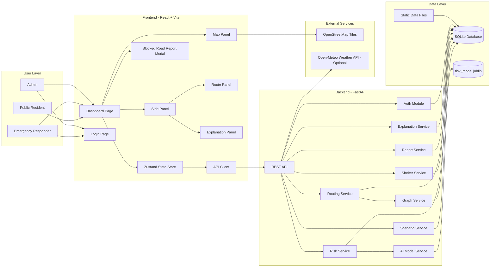
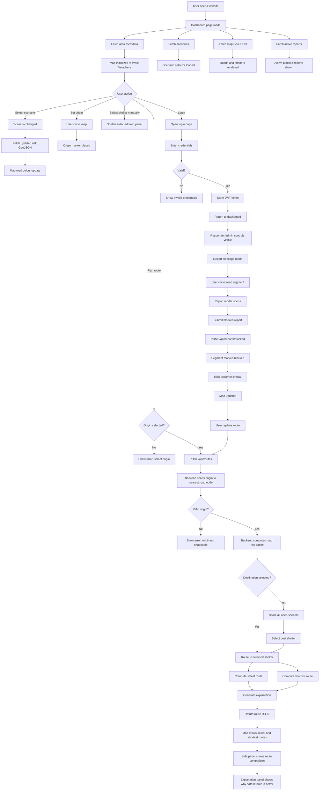
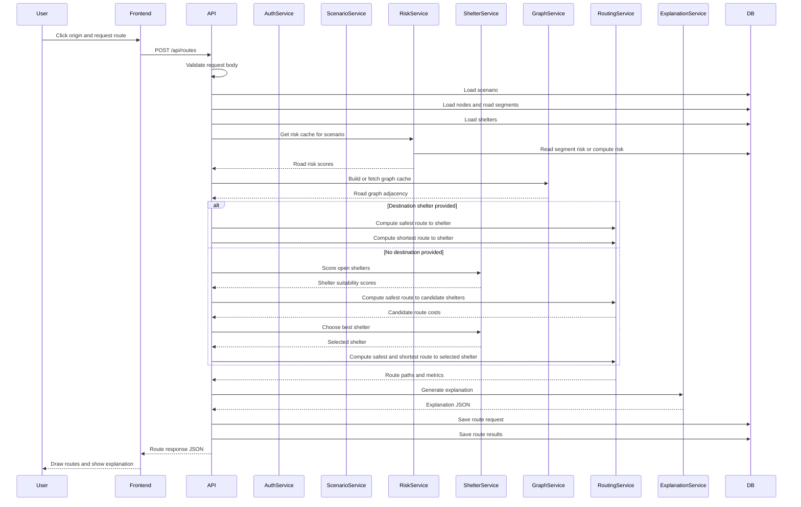
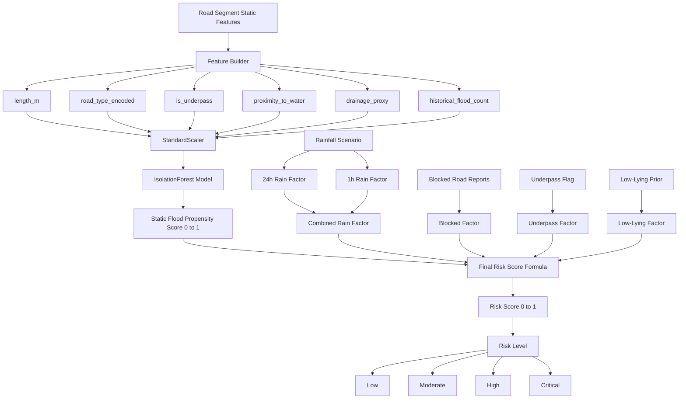
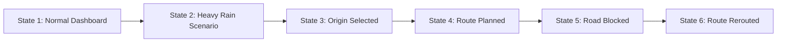

# proposal.md

Project: **SafeRoute Velachery — AI Emergency Evacuation & Safe Route Planning**  
Theme: **AI for Climate Resilience**  
Target Area: **West Velachery, Chennai, Tamil Nadu**  
Primary Hazard: **Urban flooding due to heavy monsoon / cyclonic rainfall**  
Primary Users: **Residents, emergency responders, demo judges**

---

## 1. High-Level Project Vision

SafeRoute Velachery is an AI-assisted evacuation decision-support dashboard.

It helps users answer four critical questions during flood-like conditions:

1. **Which roads are likely unsafe?**
2. **Which shelters are suitable and reachable?**
3. **What is the safest evacuation route, not just the shortest route?**
4. **If a road becomes blocked, how should the route change?**

The system is not a normal maps app. It combines:

- Road network data
- Flood risk scoring
- Rainfall scenario simulation
- Shelter suitability scoring
- AI-based road flood propensity
- Risk-weighted route planning
- Blocked-road reporting and rerouting

---

## 2. Core Product Concept

The website will show a map of West Velachery.

Roads will be colored based on flood risk:

| Risk Level | Color | Meaning |
|---|---|---|
| Low | Green | Likely safe |
| Moderate | Yellow | Some caution |
| High | Orange | Avoid if possible |
| Critical | Red | Do not use if alternate route exists |
| Blocked | Dark red dashed | Reported blocked / impassable |

Users can:

- Select a rainfall scenario
- See flood risk update on the map
- Click an origin point
- Request an evacuation route
- View safest route vs shortest route
- See explanation of why safest route is recommended
- Report blocked roads as a responder
- See route rerouting after blocked reports

---

## 3. Full System Architecture Diagram

### 3.1 Architecture Flow Diagram



---

## 4. Architecture Component Responsibilities

| Component | Responsibility |
|---|---|
| React Frontend | Displays map, panels, routes, shelters, reports, and explanations. |
| Zustand Store | Manages UI state such as selected scenario, origin, route response, user token, and errors. |
| API Client | Sends HTTP requests to backend and normalizes errors. |
| FastAPI Backend | Handles all business logic and exposes REST endpoints. |
| Auth Module | Handles login, JWT generation, password verification, and role checks. |
| Scenario Service | Manages rainfall scenarios and active scenario. |
| Risk Service | Computes flood risk for road segments. |
| AI Model Service | Produces static flood propensity score for each road segment. |
| Graph Service | Builds road graph from road segments and nodes. |
| Routing Service | Computes shortest and safest routes using risk-weighted Dijkstra. |
| Shelter Service | Scores shelters and selects best shelter if user does not choose one. |
| Report Service | Handles blocked-road reports and updates road status. |
| Explanation Service | Generates human-readable explanation for route recommendation. |
| SQLite Database | Stores users, roads, nodes, shelters, scenarios, risk values, reports, and route results. |
| Static Data Files | Stores OSM road GeoJSON, shelter JSON, scenario JSON, and flood labels. |
| OSM Tiles | Provides base map tiles. |
| Open-Meteo | Optional live rainfall source, not required for MVP demo. |

---

## 5. Full Website Flow Diagram

This diagram shows the complete flow of the website from the user’s perspective.



---

## 6. Backend Request Flow Diagram

This diagram explains what happens inside the backend when a route is requested.



---

## 7. AI and Risk Calculation Flow Diagram

The AI layer does not replace routing. It produces a flood propensity score for each road segment.



---

## 8. Complete Dashboard Design Diagram

This is the main screen that will be projected during the demo.

### 8.1 Dashboard Layout Wireframe

```text
+==============================================================================================+
| SafeRoute Velachery       [Scenario: Michaung Replay v]       [Login]  [Demo Disclaimer]    |
+==================+===========================================================================+
|                  |                                                                           |
| LEFT PANEL       |                          MAP AREA                                         |
|                  |                                                                           |
| [Tabs]           |   Roads colored by risk:                                                  |
| 1. Control       |   Green = Low                                                             |
| 2. Shelters      |   Yellow = Moderate                                                       |
| 3. Reports       |   Orange = High                                                           |
|                  |   Red = Critical                                                          |
| CONTROL TAB      |   Dark red dashed = Blocked                                               |
| ---------------- |                                                                           |
| Layer toggles    |        [Shelter marker]                                                   |
| [x] Roads        |                                                                           |
| [x] Shelters     |              [Origin marker]                                              |
| [x] Reports      |                   |                                                       |
|                  |                   | Safest route                                          |
| Origin           |                   |                                                       |
| [Set Origin]     |        [Shelter marker]                                                   |
| [Clear Origin]   |                                                                           |
|                  |                                                                           |
| Route actions    |                                                                           |
| [Plan Safest]    |                                                                           |
| [Clear Route]    |                                                                           |
|                  |                                                                           |
| SHELTERS TAB     |                                                                           |
| ---------------- |                                                                           |
| Shelter list     |                                                                           |
| Suitability bar  |                                                                           |
| Capacity info    |                                                                           |
| Select button    |                                                                           |
|                  |                                                                           |
| REPORTS TAB      |                                                                           |
| ---------------- |                                                                           |
| Active reports   |                                                                           |
| Resolve button   |                                                                           |
| Report mode btn  |                                                                           |
|                  |                                                                           |
+==================+===========================================================================+
| Route Summary / Explanation Panel                                                             |
|----------------------------------------------------------------------------------------------|
| Safest Route: 1.8 km, 9.7 min, risk 0.18, high-risk segments avoided: 4                     |
| Shortest Route: 1.4 km, 7.1 min, risk 0.63, high-risk segments: 4                           |
| Explanation: Safest route avoids AGS Colony low-lying roads and reaches open shelter.        |
+==============================================================================================+
| Status: Active scenario: Michaung Replay | Last updated: 10:32 | Server: OK                  |
+==============================================================================================+
```

---

## 9. Dashboard Panel Breakdown

### 9.1 Header

The header is always visible.

| Element | Purpose |
|---|---|
| Project title | Shows product name and target area. |
| Scenario selector | Lets user switch rainfall scenarios. |
| Login button | Allows responder/admin login. |
| Disclaimer badge | Makes it clear this is decision support, not official emergency service. |

Projected value:

> Judges immediately understand this is a flood scenario simulator and not just a static map.

---

### 9.2 Map Area

The map is the main visual element.

It displays:

| Layer | What it shows |
|---|---|
| Road layer | Roads colored by flood risk. |
| Shelter layer | Shelters as circle markers. |
| Origin marker | User-selected evacuation starting point. |
| Route layer | Safest and shortest routes. |
| Blocked road layer | Blocked segments shown as dark red dashed lines. |
| Report markers | Active blocked-road reports. |

Map visual encoding:

| Item | Visual Style |
|---|---|
| Low-risk road | Green line |
| Moderate-risk road | Yellow line |
| High-risk road | Orange line |
| Critical-risk road | Red line |
| Blocked road | Dark red dashed line |
| Safest route | Solid blue line |
| Shortest route | Dashed gray line |
| Open shelter | Green circle |
| Full shelter | Orange circle |
| Closed shelter | Red circle |
| Origin | Purple marker |

Projected value:

> Judges can visually see risk and route difference within seconds.

---

### 9.3 Left Side Panel

The side panel contains three tabs.

#### Tab 1: Control

This tab contains:

- Layer toggles
- Set origin button
- Clear origin button
- Plan safest route button
- Clear route button

Purpose:

> Controls the main demo actions.

#### Tab 2: Shelters

This tab contains:

- Shelter list
- Shelter status
- Assumed capacity
- Assumed occupancy
- Suitability bar
- Routable badge
- Select shelter button

Purpose:

> Shows that the system chooses shelters based on suitability, not only distance.

#### Tab 3: Reports

This tab contains:

- Active blocked-road reports
- Report time
- Segment name
- Note
- Resolve button for responder/admin
- Report blockage button

Purpose:

> Demonstrates dynamic rerouting after field reports.

---

### 9.4 Route Summary and Explanation Panel

This panel appears below the map or as a collapsible bottom drawer.

It shows:

| Field | Purpose |
|---|---|
| Safest route distance | Shows physical distance. |
| Safest route duration | Shows travel time. |
| Shortest route distance | Shows comparison. |
| Shortest route duration | Shows comparison. |
| Average risk score | Shows how risky each route is. |
| High-risk segments avoided | Shows AI value. |
| Blocked segments avoided | Shows dynamic rerouting value. |
| Shelter reason | Explains why shelter was selected. |
| Top route factors | Explains why safest route was chosen. |

Projected value:

> This is where the team explains measurable impact: “slightly longer, but much safer.”

---

## 10. Dashboard Demo State Flow

This shows what should be projected on screen during the demo.



### State 1: Normal Dashboard

What is visible:

- Map of West Velachery
- Mostly green roads
- Shelters visible
- Scenario set to Normal

Purpose:

> Show baseline condition.

---

### State 2: Heavy Rain Scenario

What changes:

- Scenario changed to Michaung Replay
- Roads near AGS Colony, Baby Nagar, Vijayanagar become orange/red
- Risk legend becomes important

Purpose:

> Show AI flood risk prediction.

---

### State 3: Origin Selected

What changes:

- Purple origin marker appears in a risky zone
- “Plan Safest Route” button becomes active

Purpose:

> Show user interaction.

---

### State 4: Route Planned

What changes:

- Blue safest route appears
- Gray shortest route appears
- Route comparison panel appears
- Explanation panel appears

Purpose:

> Show safest vs shortest comparison.

---

### State 5: Road Blocked

What changes:

- Responder clicks a road
- Report modal appears
- Road becomes dark red dashed
- Active report appears in Reports tab

Purpose:

> Show dynamic emergency reporting.

---

### State 6: Route Rerouted

What changes:

- Route is replanned
- New safest route avoids blocked segment
- Explanation shows blocked segments avoided

Purpose:

> Show real-time resilience.

---

## 11. Step-by-Step Build Plan

This section explains what to build, how to build it, and why.

---

## Step 1: Freeze the Demo Area

### What to create

A fixed geographic scope for the MVP.

### How

Use West Velachery with approximate bounding box:

```text
South: 12.965
West: 80.195
North: 12.995
East: 80.235
```

Focus areas:

- AGS Colony
- Baby Nagar
- Dhandeeswaran Nagar
- Vijayanagar
- Ramnagar
- Murugan Nagar
- Kuberan Nagar

### Why

A fixed area keeps the project feasible.

It also gives the demo realism because Velachery is a documented flood-prone area in Chennai.

### Completion criteria

- Area selected
- Boundary box defined
- Focus pockets listed
- Team agrees not to expand beyond this area

---

## Step 2: Collect and Prepare Data

### What to create

Three main data files:

```text
data/velachery/roads.geojson
data/velachery/shelters.json
data/velachery/scenarios.json
```

### How

#### Roads

Use Overpass Turbo to download OSM roads inside the bbox.

Query:

```overpassql
[out:json][timeout:180];
(
  way["highway"](12.965,80.195,12.995,80.235);
);
out geom;
```

Export as GeoJSON.

#### Shelters

Use GCC relief centre data or manually curate 4–6 shelters.

Each shelter should contain:

```json
{
  "name": "Shelter name",
  "type": "school",
  "lat": 12.981,
  "lon": 80.213,
  "capacity_assumed": 200,
  "occupancy_assumed": 0,
  "elevation_risk": "low",
  "accessible": true,
  "medical_support": false,
  "water_available": true,
  "status": "open"
}
```

#### Scenarios

Create four scenarios:

```json
[
  {
    "name": "Normal",
    "rainfall_mm_24h": 10,
    "rainfall_mm_1h": 0
  },
  {
    "name": "Heavy Monsoon",
    "rainfall_mm_24h": 80,
    "rainfall_mm_1h": 15
  },
  {
    "name": "Michaung Replay",
    "rainfall_mm_24h": 150,
    "rainfall_mm_1h": 30
  },
  {
    "name": "Extreme Event",
    "rainfall_mm_24h": 250,
    "rainfall_mm_1h": 50
  }
]
```

### Why

Without data, there is no demo.

Using real data makes the project credible.

Using scenarios avoids dependency on live weather.

### Completion criteria

- Roads GeoJSON loads in map or script
- At least 4 shelters defined
- At least 4 scenarios defined

---

## Step 3: Create Project Structure

### What to create

Repository folders:

```text
/backend
/frontend
/data
/models
/docs
```

### How

Create backend with:

```text
backend/app/main.py
backend/app/config.py
backend/app/database.py
backend/app/models.py
backend/app/schemas.py
backend/app/routers/
backend/app/services/
backend/app/ai/
backend/app/scripts/
```

Create frontend with:

```text
frontend/src/pages/
frontend/src/components/
frontend/src/api/
frontend/src/store/
frontend/src/styles/
```

### Why

A clean structure separates concerns:

- API layer
- Business logic
- Data layer
- AI layer
- UI layer

This helps a small team work in parallel.

### Completion criteria

- Backend can start with dummy health endpoint
- Frontend can start with blank page

---

## Step 4: Build Backend Core

### What to create

Basic FastAPI app with:

- Health endpoint
- Configuration
- SQLite database
- ORM models

### How

Create endpoints:

```text
GET /api/health
GET /api/meta/area
```

Create database tables:

- users
- nodes
- road_segments
- shelters
- scenarios
- blocked_reports
- route_requests
- route_results
- risk_snapshots
- audit_logs

### Why

All features depend on these core entities.

The health endpoint helps during demo and debugging.

### Completion criteria

- Server runs locally
- Database file created
- Health endpoint returns OK

---

## Step 5: Build Data Import Pipeline

### What to create

Script to import roads, shelters, and scenarios into SQLite.

### How

Implement:

```bash
python -m app.scripts.init_db
python -m app.scripts.seed_users
python -m app.scripts.import_data
```

Import logic:

1. Read roads GeoJSON
2. Split LineStrings into small road segments
3. Create nodes for coordinates
4. Create edges between consecutive coordinates
5. Calculate segment length
6. Store geometry as JSON
7. Read shelters
8. Snap shelters to nearest road node
9. Read scenarios
10. Insert scenarios

### Why

The routing engine needs a clean graph of nodes and edges.

The map needs GeoJSON features.

The risk engine needs segment attributes.

### Completion criteria

- Database contains nodes
- Database contains road segments
- Database contains shelters
- Database contains scenarios

---

## Step 6: Build Authentication

### What to create

Login system for responder and admin roles.

### How

Implement:

```text
POST /api/auth/login
```

Use:

- bcrypt password hashing
- JWT token
- role-based access control

Roles:

```text
public
responder
admin
```

Protected endpoints:

```text
POST /api/reports/blocked
POST /api/reports/blocked/{id}/resolve
POST /api/scenarios/{id}/activate
POST /api/admin/recompute-risk
```

### Why

Blocked-road reporting should not be open to anonymous users in the demo.

Roles make the system feel realistic.

### Completion criteria

- Login works
- JWT is returned
- Protected endpoint rejects public user
- Responder can create blocked report

---

## Step 7: Build AI Risk Engine

### What to create

A service that computes flood risk for each road segment.

### How

Use two layers:

#### Static AI layer

Train IsolationForest on segment features:

```text
length_m
road_type_encoded
is_underpass
proximity_to_water
drainage_proxy
historical_flood_count
```

Output:

```text
static flood propensity score from 0 to 1
```

#### Dynamic risk layer

Combine:

```text
rainfall scenario
static flood propensity
blocked report
underpass flag
low-lying prior
```

Output:

```text
final risk score from 0 to 1
risk level: low, moderate, high, critical
```

### Why

This is the meaningful AI component.

It is not just an LLM chatbot.

It directly affects routing.

### Completion criteria

- Model training script runs
- Model file saved
- Risk scores between 0 and 1
- Blocked segment becomes critical
- Risk changes when scenario changes

---

## Step 8: Build Map API

### What to create

Endpoint to return map data as GeoJSON.

### How

Implement:

```text
GET /api/map/geojson
GET /api/scenarios
GET /api/shelters
```

GeoJSON response should include:

- road features
- shelter features
- optional active blocked reports

Road feature properties:

```json
{
  "segment_id": 1,
  "name": "Road name",
  "risk_score": 0.78,
  "risk_level": "critical",
  "blocked": false
}
```

### Why

The frontend needs one clean endpoint to render the entire map.

GeoJSON makes Leaflet integration simple.

### Completion criteria

- Map endpoint returns roads
- Map endpoint returns shelters
- Risk values change by scenario

---

## Step 9: Build Routing Engine

### What to create

A routing service that computes shortest and safest paths.

### How

Build graph:

```text
nodes -> intersections
edges -> road segments
```

Edge cost:

```text
shortest cost = travel time + blocked penalty
safest cost = travel time + flood risk penalty + blocked penalty
```

Use Dijkstra algorithm.

Compute:

```text
distance
duration
average risk
high-risk segment count
blocked segment count
route geometry
```

### Why

This is the core evacuation feature.

The difference between shortest and safest route is the main demo moment.

### Completion criteria

- Route can be computed from origin to shelter
- Safest route differs from shortest route when risk is high
- Blocked roads are avoided if alternate path exists

---

## Step 10: Build Shelter Selection Logic

### What to create

A service that scores shelters.

### How

Score shelters using:

```text
available capacity
elevation risk
accessibility
medical support
water availability
```

Formula concept:

```text
suitability =
  capacity_score +
  safety_score +
  accessibility_score +
  medical_score +
  water_score
```

If user does not choose shelter:

1. Compute safest route to each open shelter
2. Combine route cost and shelter suitability
3. Select best shelter

### Why

Evacuation is not only about roads.

The destination must also be safe and suitable.

### Completion criteria

- Shelter suitability displayed
- Closed shelters excluded
- Auto shelter selection works

---

## Step 11: Build Frontend Dashboard

### What to create

Main dashboard UI.

### How

Build components:

```text
AppShell
MapPanel
ScenarioSelect
LayerControl
OriginPicker
ShelterPanel
RoutePanel
ExplanationPanel
ReportBlockageModal
AlertsBar
Legend
```

Use:

- React
- Leaflet
- Zustand
- Fetch API

Frontend flow:

1. Load dashboard
2. Fetch map data
3. Render map
4. Handle user clicks
5. Call route API
6. Draw routes
7. Show explanation

### Why

The dashboard is what judges see.

It must be simple, visual, and stable.

### Completion criteria

- Map renders
- Scenario selector works
- Roads colored by risk
- Shelters visible
- No console-breaking errors

---

## Step 12: Build Route Planning UI

### What to create

UI for setting origin and requesting route.

### How

Add buttons:

```text
Set Origin
Clear Origin
Plan Safest Route
Clear Route
```

When route response arrives:

- Draw safest route in blue
- Draw shortest route in gray
- Show comparison table
- Show explanation panel

Comparison table:

```text
Metric              Safest       Shortest
Distance            1.8 km       1.4 km
Duration            9.7 min      7.1 min
Average risk        0.18         0.63
High-risk segments  0            4
Blocked segments    0            0
```

### Why

This is the most important judge-facing feature.

It shows measurable value.

### Completion criteria

- Origin can be selected
- Route request succeeds
- Two routes drawn
- Explanation visible

---

## Step 13: Build Blocked Road Reporting

### What to create

Responder workflow for marking roads blocked.

### How

Add:

```text
Report Blockage button
Report mode
Road click handler
Report modal
Submit report API call
Active reports list
Resolve report button
```

Flow:

1. Responder logs in
2. Clicks Report Blockage
3. Clicks road segment
4. Adds optional note
5. Submits report
6. Backend marks segment blocked
7. Map updates
8. User replans route

### Why

This demonstrates dynamic emergency response.

It turns the system from a static map into a responsive decision-support tool.

### Completion criteria

- Responder can block a road
- Road becomes dark red dashed
- New route avoids blocked road
- Responder can resolve report

---

## Step 14: Build Explanation Engine

### What to create

A service that explains why the safest route was chosen.

### How

Generate explanation from:

```text
additional time
high-risk segments avoided
blocked segments avoided
shelter suitability
route warnings
```

Example:

```text
The safest route adds 2.6 minutes compared to the shortest route.
It avoids 4 high-risk road segments.
It avoids 0 blocked road segments.
The selected shelter has available assumed capacity and low elevation risk.
```

### Why

Judges need to understand the AI decision.

Explanation builds trust.

### Completion criteria

- Explanation panel appears after route response
- Numbers match route metrics
- Warnings appear if route uses blocked segments

---

## Step 15: Add Demo Fallback and Stability

### What to create

A stable demo mode.

### How

1. Cache map GeoJSON locally
2. Store seeded scenarios in database
3. Do not depend on live weather
4. Record backup demo video
5. Keep screenshot fallbacks
6. Add loading and error states
7. Test with internet disconnect

### Why

Hackathon demos fail when external services fail.

The MVP must work offline except for base map tiles.

### Completion criteria

- Demo works without Open-Meteo
- Demo works with seeded data
- Error messages are clear
- Backup video exists

---

## Step 16: Test and Polish

### What to create

Testing and final presentation readiness.

### How

Test:

- Login
- Scenario switch
- Origin selection
- Route planning
- Blocked reporting
- Rerouting
- Error states
- Empty data states
- Network failure

Polish:

- Color contrast
- Legend clarity
- Button labels
- Route line thickness
- Explanation wording
- Demo script timing

### Why

A working but confusing demo loses points.

A clear demo with simple AI wins.

### Completion criteria

- Full demo runs under 2 minutes
- No critical console errors
- Route comparison is obvious
- Risk map is visually clear

---

## 12. MVP Feature Priority

### Must Have

| Feature | Importance |
|---|---|
| Map dashboard | Critical |
| Scenario selector | Critical |
| Road risk visualization | Critical |
| Shelter markers | Critical |
| Origin selection | Critical |
| Safest route planning | Critical |
| Shortest route comparison | Critical |
| Explanation panel | Critical |
| Blocked road reporting | Critical |
| Dynamic rerouting | Critical |

### Should Have

| Feature | Importance |
|---|---|
| Shelter suitability panel | High |
| Active reports list | High |
| Validation summary | Medium |
| Route history | Medium |

### Nice to Have

| Feature | Importance |
|---|---|
| Live weather integration | Optional |
| Tamil/English toggle | Optional |
| Historical backtest | Optional |
| SMS alert mock | Optional |

---

## 13. What Judges Should See on Screen

The projected demo should always show these five things clearly:

### 1. The Map

Judges should immediately see:

- West Velachery
- Roads
- Shelters
- Risk colors

### 2. The Scenario

Judges should see:

```text
Normal -> Michaung Replay
```

and the map should visibly change.

### 3. The Route Decision

Judges should see:

```text
Shortest route vs Safest route
```

The safest route should be visually obvious.

### 4. The Explanation

Judges should see measurable benefits:

```text
Avoids 4 high-risk segments
Adds only 2.6 minutes
Reaches open shelter
```

### 5. The Dynamic Update

Judges should see:

```text
Road blocked -> route rerouted
```

This is the strongest demo moment.

---

## 14. Final Proposed Demo Script

### 0:00–0:15

Open dashboard.

Say:

> “This is SafeRoute Velachery, an AI evacuation planning system for a flood-prone area in Chennai.”

### 0:15–0:35

Show normal scenario.

Say:

> “Under normal rainfall, most roads are low risk.”

Switch to Michaung Replay.

Say:

> “When heavy rainfall is simulated, the AI flags low-lying and flood-prone road segments.”

### 0:35–1:05

Select origin and plan route.

Say:

> “The shortest route passes through risky roads. Our system recommends the safest route to a suitable shelter.”

Show comparison.

Say:

> “The safest route takes slightly more time but avoids high-risk segments.”

### 1:05–1:35

Login as responder.

Mark a road blocked.

Say:

> “A field report marks this road as blocked. The system updates the risk map immediately.”

Replan route.

Say:

> “The evacuation route is recalculated to avoid the blocked road.”

### 1:35–2:00

Show explanation.

Say:

> “This converts rainfall, road data, and field reports into safer evacuation decisions for climate resilience.”

---

## 15. Final Build Sequence Summary

```text
Step 1: Freeze area
Step 2: Prepare data
Step 3: Create repo structure
Step 4: Build backend core
Step 5: Import roads, shelters, scenarios
Step 6: Add authentication
Step 7: Build AI risk engine
Step 8: Build map API
Step 9: Build routing engine
Step 10: Build shelter scoring
Step 11: Build dashboard UI
Step 12: Build route planning UI
Step 13: Build blocked-road reporting
Step 14: Build explanation engine
Step 15: Add fallback and stability
Step 16: Test and rehearse demo
```

---

## 16. Success Criteria for the Proposal

The project is ready for the hackathon if:

1. Dashboard loads reliably.
2. Map shows real West Velachery roads.
3. Scenario switch changes road risk colors.
4. User can select origin.
5. System returns safest and shortest routes.
6. Safest route avoids high-risk roads.
7. Explanation panel clearly justifies the route.
8. Responder can mark a road blocked.
9. Route reroutes after blockage.
10. Demo completes in under 2 minutes.